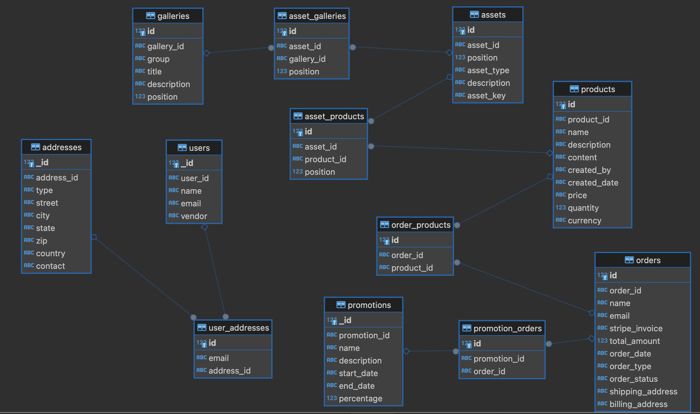

# Manna Group International

MANNA International Corp. is introducing products in healthcare areas like Nutraceutical Supplements, 
OTC pharmaceuticals & Essential Oils. This is the new version of the website


- [Current Website](https://mannagroupintl.com/)
- [Deployed API](https://manna-grp-intl-api.fly.dev/docs)

## Important Links

- [PostHog - Product analytics tool free](https://us.posthog.com/project/113825/products)
- [Tuono - Fullstack Rust React Framework](https://tuono.dev)
- [Typescript "satisfies" operator](https://www.freecodecamp.org/news/typescript-satisfies-operator/)
- [Saasable Material UI kit](https://mui.com/store/items/saasable-free-multipurpose-ui-kit-dashboard/)
- [Stackoverflow - Gemini VSCode Cloud SDK error](https://stackoverflow.com/questions/70707146/visual-studio-perpetually-reinstalls-cloud-sdk)
- [Framer Motion becomes Motion](https://motion.dev/docs/react-quick-start)
- [Automated Passive Income](https://medium.com/coinmonks/passive-income-with-automated-cryptocurrency-news-991d98e87020)
- [Turso - SQLLite DB on cloud pricing](https://turso.tech/pricing)
- [ShadCN - Form Builder](https://shadcn-form-build.vercel.app/playground)
- [ShadCN Data Table documentation](https://ui.shadcn.com/docs/components/data-table)
- [SVG Backgrounds](https://www.svgbackgrounds.com/set/free-svg-backgrounds-and-patterns/)
- [Animated SVG loaders](https://www.svgbackgrounds.com/elements/animated-svg-preloaders/)
- [Scalar - Next upgrade to Swagger docs](https://scalar.com)
- [Github Reference project for SQL](https://github.com/avj2352/time-travel-v3/tree/feature/sql)
- [AWS RDS JDBC Drivers](https://docs.aws.amazon.com/elasticbeanstalk/latest/dg/java-rds.html#java-rds-drivers)
- [Rust workbook](https://francescociulla.gumroad.com/l/rustworkbook?_gl=1*en7586*_ga*MTgyMjgzNzI4LjE3MjU1NDU3ODc.*_ga_6LJN6D94N6*MTcyNTU0NTc4Ny4xLjEuMTcyNTU0NTgzMC4wLjAuMA..)
- [Javascript - Console Log alternatives](https://dev.to/alishgiri/say-no-to-consolelog-556n?ref=dailydev)
- [Cloudfront URL](https://d2sjpgezzxd3c7.cloudfront.net)
- [Miro planning board](https://miro.com/app/board/uXjVKM2zjnA=/)
- [DaisyUI - Template for React Manna Website](https://daisyui.com)
- [React Carousel - Embla](https://www.embla-carousel.com)
- [React Worldmap - Library](https://www.react-simple-maps.io)
- [React Grommet - Worldmap](https://v2.grommet.io)
- [React Tailwind Layout](https://www.radix-ui.com)
- [Open source - free image generator AI](http://flowgpt.com/)
- [Limited image gen AI](https://openart.ai)
- [Animated guide around the website / web-app](https://driverjs.com)

# From Swagger to Scalar Documentation

```bash
pip install scalar-fastapi
```

```python
# Integrate with FastAPI - Scalar docs client
from fastapi import FastAPI
from scalar_fastapi import get_scalar_api_reference

app = FastAPI()

@app.get("/")
def read_root():
    return {"Hello": "World"}

@app.get("/scalar", include_in_schema=False)
async def scalar_html():
    return get_scalar_api_reference(
        openapi_url=app.openapi_url,
        title=app.title,
    )
```


# Data Model

Data Model for an E-commerce Application



```bash
## User table is managed by Auth0

User
-----
_id PK int
name string
email string
vendor string
photo_url string NULL

# searchable
Product
-----
_id PK int
name string
description string NULL
content string
created_by int FK - User._id
created_date string
price string
quantity int
# USD / EUR / INR
currency string

# searchable
Asset
---
_id PK int
position int
# product / gallery / thumbnail / other
type string
description string
link string


AssetProduct
---
_id PK int
asset_id int FK - Asset._id
product_id int FK >- Product._id

# searchable
Order
---
_id PK int
name string
email string
# stripe id
stripe_invoice string
total_amount int
order_date string
# on-delivery / online
order_type string
# pending / shipped / delivered
order_status string
shipping_address string
billing_address string

OrderProduct
---
_id PK int
order_id int FK - Order._id
product_id int FK >- Product._id

# searchable
Gallery
---
_id PK int
group string
title string
description string
position int

AssetGallery
---
_id PK int
asset_id int FK - Asset._id
gallery_id int FK >- Gallery._id

```


# AWS Cloudformation template to connect to RDS Instance

The following Cloudformation template creates RDS Instance which is publicly accessible on port 5432. It also creates username and password
as AWS Secrets

To connect using **DBeaver** client, sometimes you might need the JDBC driver for PostgreSQL. They are found in the link - [Download RDS JDBC Drivers](https://docs.aws.amazon.com/elasticbeanstalk/latest/dg/java-rds.html#java-rds-drivers)

```typescript
import {
  Duration,
  RemovalPolicy,
  Stack,
  StackProps,
  CfnOutput,
} from "aws-cdk-lib";
import {
  InstanceClass,
  InstanceSize,
  InstanceType,
  Peer,
  Port,
  SecurityGroup,
  SubnetType,
  Vpc,
} from "aws-cdk-lib/aws-ec2";
import {
  Credentials,
  DatabaseInstance,
  DatabaseInstanceEngine,
  PostgresEngineVersion,
} from "aws-cdk-lib/aws-rds";
import { Secret } from "aws-cdk-lib/aws-secretsmanager";
import { Construct } from "constructs";

export class MannaGrpDBStack extends Stack {
  constructor(scope: Construct, id: string, props?: StackProps) {
    super(scope, id, props);

    // postgresql configuration
    const engine = DatabaseInstanceEngine.postgres({
      version: PostgresEngineVersion.VER_15,
    });
    const instanceType = InstanceType.of(InstanceClass.T3, InstanceSize.MICRO);
    const port = 5432;
    const dbName = "manna_grp_rds_db";
    const username = "postgres";

    // Create a VPC and subnet for the DB instance
    const vpc = new Vpc(this, "MannaGrpDBVpc", {
      maxAzs: 2,
      subnetConfiguration: [
        {
          cidrMask: 24,
          name: "Public",
          subnetType: SubnetType.PUBLIC,
        },
      ],
    });

    // Create a Secrets Manager secret to store the database credentials
    // MannaGrpDatabaseSecret
    const databaseSecret = new Secret(this, "MannaGrpDatabaseSecret", {
      secretName: "manna-grp-app-database-secret",
      description: "Manna group DB master user credentials",
      generateSecretString: {
        secretStringTemplate: JSON.stringify({ username }),
        generateStringKey: "password",
        passwordLength: 16,
        excludePunctuation: true,
      },
    });

    // Create a Security Group that allows inbond traffic on the database port
    const dbSg = new SecurityGroup(this, "MannaGrpDBSecurityGroup", {
      securityGroupName: "MannaGrpDBSecurityGroup",
      vpc,
      allowAllOutbound: true,
      description: "Security Group for RDS instance",
    });

    // Add Inbound rule - for dev, allo inbound traffic on the database port
    dbSg.addIngressRule(
      Peer.anyIpv4(),
      Port.tcp(port),
      "Local Development - connect frm anywhere"
    );

    // create RDS instance (PostgreSQL)
    const dbInstance = new DatabaseInstance(this, "MannaGrpDBRDSInstance", {
      vpc,
      vpcSubnets: { subnetType: SubnetType.PUBLIC },
      instanceType,
      engine,
      port,
      securityGroups: [dbSg],
      databaseName: dbName,
      credentials: Credentials.fromSecret(databaseSecret),
      backupRetention: Duration.days(0), // disable automatic DB snapshot retention
      deleteAutomatedBackups: true,
      removalPolicy: RemovalPolicy.DESTROY,
    });

    // Output the connection string and credentials
    new CfnOutput(this, "MannaGrpDBDatabaseEndpoint", {
      value: dbInstance.dbInstanceEndpointAddress,
    });

    new CfnOutput(this, "MannaGrpDBDatabaseUsername", {
      value: username,
    });
  }
}

```

# Website Statistics

The following provides a summary of website performance improvements and statistics

### Current Website Statistics

- Techstack: Php + Wordpress + Javascript libraries
- Link: https://mannagroupintl.com
- Avg Time taken to load (with cache disabled): 1.49 seconds
- Resources loaded: 108
- Size of loaded assets: 8.01 mb
- Size of transferred assets: 5.55 mb
- Avg time taken to load website: under 1 minute
- Lighthouse (Google) score: 59

### New Website Statistics

- Techstack: React + AWS
- Link: https://d2sjpgezzxd3c7.cloudfront.net (to be hosted)
- Avg Time taken to load (with cache disabled): 277 milliseconds
- Resources loaded: 18
- Size of loaded assets: 1.5 mb
- Size of transferred assets: 1.13 mb
- Avg time taken to load website: under 33 milliseconds
- Lighthouse (Google) score: 77

# Mannagroup international transfer from GoDaddy to AWS

The following are the Nameservers to Wordpress Site:

```bash
# domain name servers
ns8267.hostgator.com
ns8268.hostgator.com
```


# Feature - Shipment
Shipment is handled directly by Manna. Status for Shipment to be reflected in website:

When users login, they can track their status in Manna Website.
- In process, shipped, delivered - email for each status change
- Notes: Tracking number, Shipment number

# GDPR measures when storing Billing & Shipping Address

When it comes to storing customer billing and shipping addresses in
an ecommerce application while complying with GDPR, several key data protection measures must be implemented:

## Data Minimization

Collect only the necessary data for billing and shipping purposes. Avoid collecting
excessive or irrelevant information. For example, limit address collection to essential
fields like name, street address, city, postal code, and country.

## Encryption and Security

- Implement robust security measures to protect stored address data:
- Use strong encryption for all personal data, including billing and shipping addresses.
- Apply access controls to limit data access to only those employees who require it for their roles.
- Conduct regular security audits to identify and address vulnerabilities in your systems.

## Data Storage and Retention

- Store address data only for as long as necessary for business purposes.
- Implement a data retention policy that specifies how long address information will be kept and
when it will be securely deleted.
- Regularly review and purge unnecessary address data from your systems.

## User Rights and Control

- Provide customers with control over their address data:
- Allow customers to easily view, edit, or delete their stored addresses.
- Implement a simple process for handling data access and deletion requests.
- Enable customers to choose which addresses they want to save for future use.

## Consent and Transparency

- Obtain explicit consent from customers before storing their address information
for purposes beyond order fulfillment.
- Clearly inform customers about how their address data will be used, stored,
and protected in your privacy policy.

## Third-Party Processors

If using third-party services for order processing or fulfillment:
- Ensure these services are GDPR-compliant.
- Have data processing agreements in place with all third parties that handle customer address data6.

## Documentation and Accountability

Maintain detailed records of how address data is collected, processed, and stored.
- Assign a team member or data protection officer to oversee GDPR compliance
related to address data management.

## Cross-Border Considerations

If transferring address data outside the EU:
- Ensure that the data is protected to GDPR standards, using approved mechanisms
like Standard Contractual Clauses.
- Keep address data within the EU or EU Commission approved countries when possible.

By implementing these measures, ecommerce businesses can better protect customer billing
and shipping address data in compliance with GDPR requirements, fostering trust and
demonstrating commitment to data privacy.


## WARNING - Cease & Desist Letter

Subject: Cease and Desist - Copyright Infringement of Website Content including domain name
Dear Sir/Madam,

I am writing to formally notify you that the following website - https://mannacorpintl.com which was purchased
using namescheap.com, is infringing on my exclusive copyrights by copying and reproducing the content of my
website without authorization. The original website https://mannagroupintl.com is protected under United
States copyright law, and the unlawful copying (which includes purchase of domain with similar name) is a
serious matter that requires your immediate attention.

It has come to my attention that the domain for the duplicate website "https://mannacorpintl.com" that is
substantially similar to the original website, copying text, images, and layout without permission.
This unauthorized use of the copyrighted material constitutes a clear violation of the original website /
company intellectual property rights. As the rightful owner of this content, I demand that you take
immediate action:

- Cease the working of the domain purchased under namescheap - "mannacorpintl.com"
- Remove all infringing content from the website
- Cease any further use or distribution of my copyrighted material
- Provide written confirmation of your compliance with these demands

Please be advised that if you do not comply with these demands at the earliers, I will be forced to pursue
further legal action. This may include seeking statutory damages of up to $150,000 per infringement,
as set forth in Section 504(c)(2) of the U.S. Copyright Act.

We have documented evidence of the infringement, including screenshots and archived versions of your website.
This evidence will be used to support the company claim if necessary.

To resolve this matter amicably, please respond in replying at the earliest,
confirming that you have complied with the above demands.

This letter is sent without prejudice to my legal rights, all of which are expressly reserved.

Sincerely,
George Varges
Founder - Manna Group International
https://mannagroupintl.com
